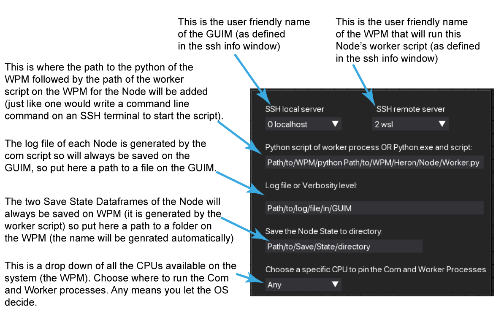

Setting up and using multiple machines
======================================

One of Heron's major strengths is that it offers multiple machine connectivity. That means that a single pipeline as
represented by a Graph on Heron's GUI can be composed by Nodes whose worker processes run on different machines.
The following explains how one can setup the different machines to achieve these multi machine pipelines.

Setting up the machines
----------------------

In most cases that involve experimental set ups it is the experimenter that will have to physically connect together
the different machines in order to create a Local Access Network (LAN). How to do this is a bit beyond the scope of this
documentation. Of course if you are lucky and someone else has set up a LAN for you then congrats.

In both cases there is a conceptual separation between the machine that runs Heron's GUI (let's call it the GUI Machine
:= GUIM) and the machines that simply run one or more worker processes (let's call those the worker process machines
:= WPMs).
The end result of any type of LAN setup should be something that fullfills the following points:

#. All machines should be running an SSH client and an SSH server.
#. The GUIM needs to be able to SSH into all the WPMs (accounts, IPs and ports all working).
#. All WPMs need to be able to SSH into the GUIM (the GUIM account, IP and ports all set up).
#. All WPM SSH accounts (the accounts that the GUIM would use to SSH into the WPMs) need to have enough rights to allow running the worker processes under consideration from an SSH terminal.
#. (Optional but highly desirable) All machines would be nice to have static IP addresses. If they don't and the IPs change every so often then the new IP addresses would need to be updated into Heron's ssh info window. Not fun.
#. All WPMs should have Heron and the required code in the Operations folder of the Heron/Heron folder to run the required worker processes.
#. The GUIM should of course have Heron but should also have all the code in its Heron/Heron/Operations folder for all the Nodes in the pipeline including the Nodes that run on the WPMs.

To give an example of the above points. Let's say that one needs to run a Heron pipeline that needs to control a
`Near-Zero <https://skysedge.com/robotics/nearzero/index.html>`_ gimbal motor controller connected to a rapsbery pi.
The GUIM needs to have Heron and also the
`Near-Zero Controller repository <https://github.com/Heron-Repositories/NearZero-Controller>`_
installed in Heron's Operations folder (on how to do this see :doc:`adding_repos`). The WPM (the raspberry pi) needs to
also have Heron and the Near-Zero Controller repository in that Heron's Operations folder. Both the GUIM and the WPM
need to be running an SSH server and client. Also the account on the WPM that the GUIM will SSH needs to have access
rights to be able to run the

.. code-block:: python

    path_to_WPM_python.exe path_to_near_zero_controller_worker.py

command that the GUIM's Heron will call through SSH on the WPM.

So, setting up a Heron pipeline over multiple machines requires a physical LAN having Heron and all required Nodes
on all machines and setting up the SSH clients and servers on these machines in such a way that the GUIM can call python
scripts on the WPMs.

Setting up the LAN in Heron
---------------------------

Once all machines have been connected and configured appropriately then Heron needs to be told about them. This is done
through the ssh info window under the Local Network -> Edit IPs/ports menu buttons of the Menu Bar (see :doc:`the_editor`
and Figure 1).
That window is a table where one can input the SSH configuration of all the computers in the pipeline. The *Add ssh server*
button will add another entry in the table while the *Remove ssh server* will delete any entry that is checked (with the
checkbox at the left of the entry).

Figure 1.

Each entry has 6 required boxes. The *ID* gets filled in automatically as a new entry is added. The *Name* is a user friendly
name of the computer that the user will see in the drop downs where different machines can be added (see further on).
The *IP* and *port* boxes are the IP of the machine and the open port that another machine can SSH into.
The *username* and *password* boxes are self explanatory. Currently Heron uses a username / password authentication
technique. The username and password (as mentioned above) need to belong to an account with enough rights to run the
Node Python scripts.

If multi machine pipelines are going to be used there must always be an entry for the local computer (the GUIM).
The IP and port for that needs to be what a WPM would use to SSH into the GUIM. There is no requirement for username
and password but the boxes need to be filled in with something.

Setting up the pipeline
-----------------------

The first step to set up any pipeline is to put the required Nodes in Heron's Node editor and connect them appropriately.
For a pipeline that has Nodes (worker scripts) running on machines other than the GUIM there is also the requirement
to let Heron (the one running on the GUIM) know where the pythons and worker scripts of the WPMs' Nodes are in those
WPMs. This is done through the secondary window of a Node (see Figure 2) which appears when the blue button at the
bottom left of every Node is pressed..

Figure 2.

The SSH local server has to be populated with the user friendly name of the local computer (as set in the ssh info window)
and the SSH remote server with the user friendly name of the WPM that will run the worker script. These are drop down menus
and will give as options all the user friendly names currently saved in Heron.
The *python script of worker process OR Python exe and script* is automatically populated with the path on the GUIM of
the worker script of the Node (so when a Node runs on the GUIM it usually does not need to be changed). But when the Node
runs on a WPM then the info here needs to be different.
In this case there needs to be the python executable of the WPM followed by the python worker script of the Node on the
WPM (both with full, absolute paths). So in the case of the raspberry pi above running a Near-Zero Controller Node
this entry would look something like

.. code-block:: python

    /pi/Miniconda3/python.exe /pi/Heron/Heron/Operations/Sinks/Motion/NearZero_Controller/near_zero_controller_worker.py

if for example the python running on the pi was a miniconda installation.
Practically one needs to put in this entry box the same command one would need to write in an SSH terminal connected to
the base directory of the WPM in order to run the worker script.

The other two entries in the secondary window are by default empty and are used for debugging and data saving purposes
(see :doc:`debugging` and :doc:`the_relic_system`). The important detail in the case of running a Node in a WPM is
that the log file in the *Log File or Verbosity Level* entry box needs to be a file in the GUIM because it is generated
by the com process (which always runs on the GUIM). On the other hand the path where the Relic for this Node is going
to be saved needs to be a path in the WPM.

Multiple environments
---------------------

A direct consequence of being able to define the python executable that a worker process should be run with in each
Node's secondary window is the fact that even on the same machine different Nodes can run using different Python
environments, each set up specifically to support the functionality of a small set of Nodes. For example the
`Spinnaker Camera <https://github.com/Heron-Repositories/Spinnaker-Camera>`_ Node can only run under a Python 3.8
environment since the PySpin library it needs to interface with the Flir camera does not run on Pythons newer than
3.8. One can set up a Python 3.8 with PySpin environment separate to the environment that Heron and most of its Nodes
run on and still be able to grab the frames a Flir camera generates and process them with code running in different
(more modern) environments. All one would have to do is add to the 
*python script of worker process OR Python exe and script* entry box the full path to the environment's python
executable in front of the full path of the worker script to the Node.

