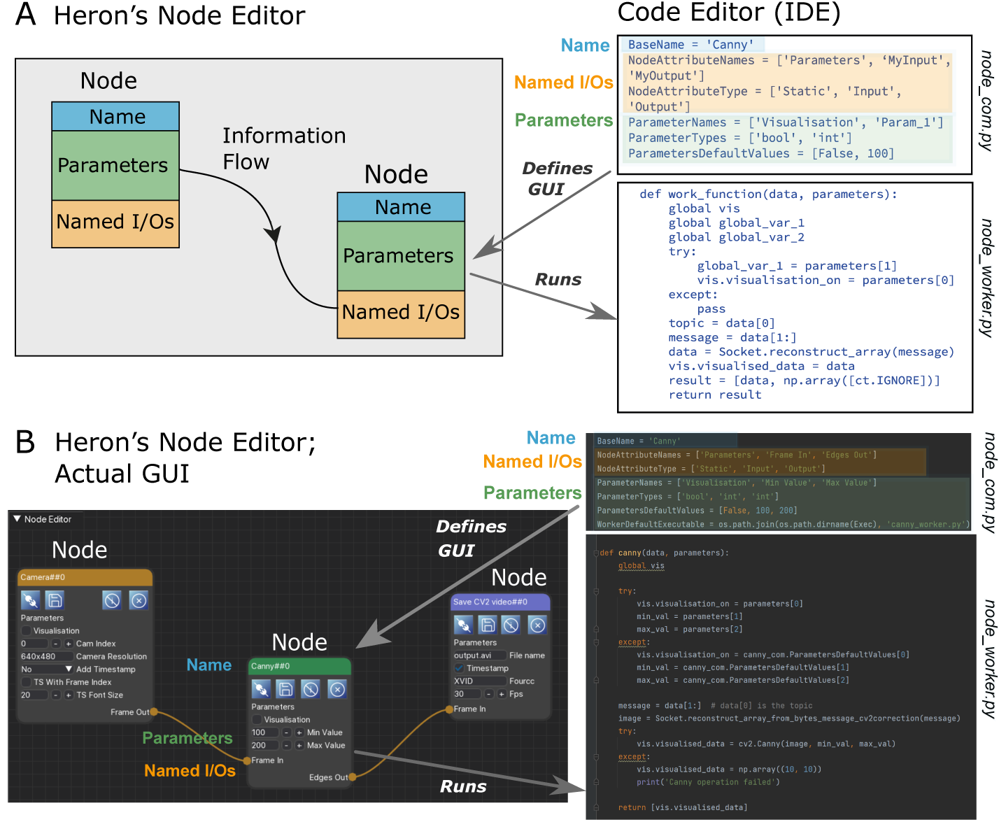

All about Nodes
================

A Node in Heron is a word of many faces. It is used interchangeably to mean either the two processes that
are responsible for executing a certain functionality and communicating with other Nodes (so the Actor in the Actor-based
architecture that Heron defines), or the little Node GUI in Heron's Node Editor representing this functionality
and giving access to the worker script's state through its Parameters user inputs. It can also
be used as a synonym of the folder structure that holds the text based code that Python interprets into this functionality.
In most cases the meaning is pretty clear from the context in which the word is used.

So a Node is an amalgam of a group of graphical elements, a corresponding folder structure, a set of
necessary and sufficient Python scripts in that structure and the two processes that run when Python interprets those
scripts.

The connection between the graphical elements representing a Node, the Node's scripts and the processes that are the
functional part of the Node can be seen in Figure 1.

Figure 1. A. A schematic describing the basic idea of the correspondences between a Node's GUI, the com script that
defines this, the Node's functionality / processes and the worker script that defines those. B. A simple example of a Heron
pipeline showing fragments of code that define the Canny Node (both its GUI and its functionality).

The scripts
___________

A thorough description of a Node's folder structure can be found in :doc:`adding_repos`. Here we will explain what is
inside a Node's base folder (usually named using the Node's name) and how the files found there work together to create
the Node's GUI and functionality.

Heron expects to see two scripts in the base Node folder. One named *whatever_you_want_com.py* and one
*whatever_you_want_worker.py*. It is good practice to use the name of the Node to name those two files but Heron won't mind.
Other users of your Node might though. All that Heron will look for is for two python scripts that finish in _com.py and
_worker.py. When Heron starts, it scans its Operations folder and creates Node buttons (see :doc:`the_editor`) for all
folders in the subdirectories inside the Source, Transform and Sink folders assuming that each one of these Node folders
has a xxx_com.py and a xxx_worker.py script. The xxx_com.py script will help Heron create the Node's GUI when a Node
button is pressed and a Node is added to the Node Editor window. The xxx_worker.py will be called by Heron when a Graph
has started.

The _com script is heavily prescribed by Heron and a Node developer is allowed to only change the values of the
predefined variables in it. On the other hand the xxx_worker.py script is there for the Node developer to complete and
Heron only expects two required functions, the one to be defined as the worker_function and the one to be defined as
the end_of_life function. Heron can also deal with one optional function, to be defined as the initialisation function.
For more details on how Nodes are composed through the xxx_com.py and xxx_worker.py scripts see :doc:`writing_new_nodes`.

The Node types
----------------

Heron understands three types of Nodes, Sources, Transforms and Sinks. The main difference between them is the
inputs and outputs they are allowed to have. Sources generate their own data and can only have outputs (no inputs).
Transforms take data from other Nodes into their inputs and, well, transform them, sending the transformed data out to
other Nodes through their outputs. So the they have both inputs and outputs. Finally Sinks are meant to take data from
previous Nodes in the pipeline and do something with them without passing them further on (no no outputs).

Creating a Graph (Pipeline)
____________________________

To create a pipeline ones does the pretty obvious. Preses the Node buttons that the pipeline requires, connects the
the Nodes that have now appeared on the Node Editor window (by connecting an output of one Node to an input of another)
and finally sets the parameter values for the different Nodes (don't forget to save). That's it.

Running a Graph (a Node's life)
________________________________

Once a Graph has been constructed then one can press the *Start Graph* button which will do two things.
First it will stop Heron from acting like a pipeline editor (no Nodes can be added, deleted or (dis)connected). Second
it will go through all the Nodes in the Node Editor window and (in order of addition to the window) it will start their
respective xxx_worker.py scripts. That means that Heron will first check to see if an initialisation function is
defined in the xxx_worker.py script and if yes it will call it, and keep calling it until it returns True. If there
is no initialisation function or when it has returned True, Heron will pass the parameter values from the Node's GUI
to the xxx_worker.py script and then, well it depends on what type the Node is.

For Source Nodes, Heron will call the worker_function in the xxx_worker.py script once. This assumes that the function
is an infinite loop that generates data and deals itself with passing those to the com process of Heron (this is much
simpler than it sounds and you can see how it is done in :doc:`writing_new_nodes`).

For Transform and Sink Nodes Heron will call the worker_function of the xxx_worker.py script as a callback every time
that new data have arrived in the Nodes inputs. The worker_function of these Nodes is expected to return a list of
numpy arrays, each array corresponding to one of the Node's outputs, which Heron will deal with from that point on (again
see :doc:`writing_new_nodes`).

Heron will call the worker_function of a Node if there are new data in AND the previous call has returned. If any new
data arrive at the Node's input and the worker_function from the previous call is still running then Heron will drop
the new data which will be lost. **IMPORTANT:** *Heron has no buffer to hold any messages that come into a Node that is
still processing its previous message.* It is up to the user to verify that no important messages are lost. For that
Heron offers a number of debugging tools (see :doc:`debugging`).

The above fully define what a Node does during an active Graph. Once the *Stop Graph* button has been pressed (or Heron
is closed down) then all processes (the three forwarders and the com and worker processes for all Nodes) are killed
(see below). At this point each Node will execute its on_end_of_life function taking care of any loose ends.

The Heartbeat System
_____________________

While a Graph is running Heron sends every so often a message to all the Nodes telling them that all is fine and they
should keep on operating. This is called a Heartbeat and the number of heartbeats per second is defined in the
constants.py script (Heron/Heron/constants.py) as HEARTBEAT_RATE. It is by default set to 1 (message per second) but
it can be changed by the user if needs be.

Each Node while running is also running on a separate thread a receiver of the heartbeat message. This thread keeps
track of how long ago the last received heartbeat message was delivered to the Node. If this time surpasses
HEARTBEATS_TO_DEATH seconds (also defined in the constants.py script) then the worker process of the Node calls its
on_end_of_life function and then terminates itself.

This system allows the worker process that is running on a different machine to actually terminate without the com
process that initiated it in the first place having to issue a kill command (which in the case of processes over
different machines usually doesn't work).

The HEARTBEATS_TO_DEATH is an important constant for a user to control (and eventually will be accessed through Heron's
GUI). It tells each Node how long it should wait without a heartbeat signal before it kills itself. There is a very
important caveat to this system. In a Transform or Sink Node a heartbeat can be received only every time the
worker_function is called (a Source's heartbeat is received any time it is sent). If it takes the worker process to
long to either initiate (e.g. because of a slow connection between machines when the Node's worker process is running
on a different machine) or the worker_function to actually run a single time then the worker process will terminate
itself since the check of the time passed since the previous received heartbeat is done continuously. That means that
for Transfer and Sink Nodes that are slower in their initialisation or worker_functions than
HEARTBEATS_TO_DEATH * HEARTBEAT_RATE seconds the Node will always kill itself. The solution to this is to increase one
of those two constants. These constants can have different values on different machines.

