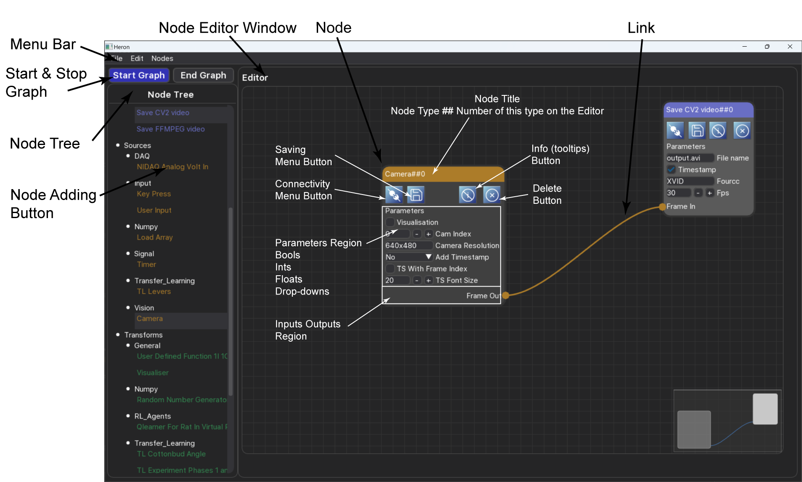
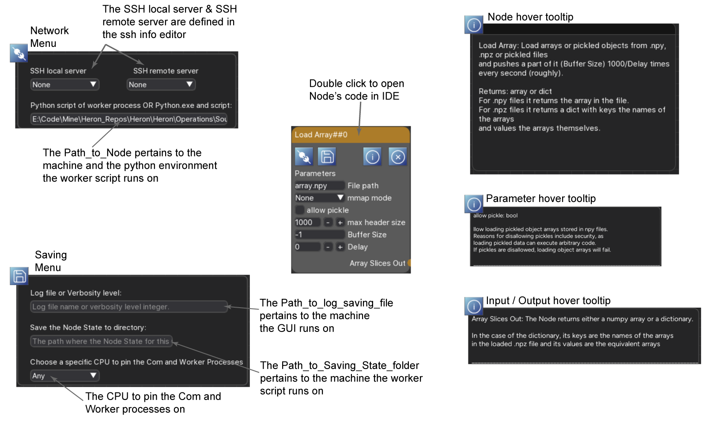
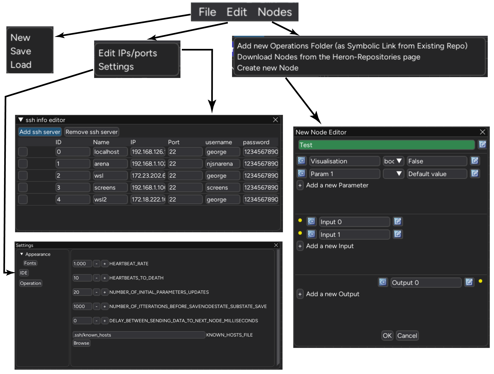
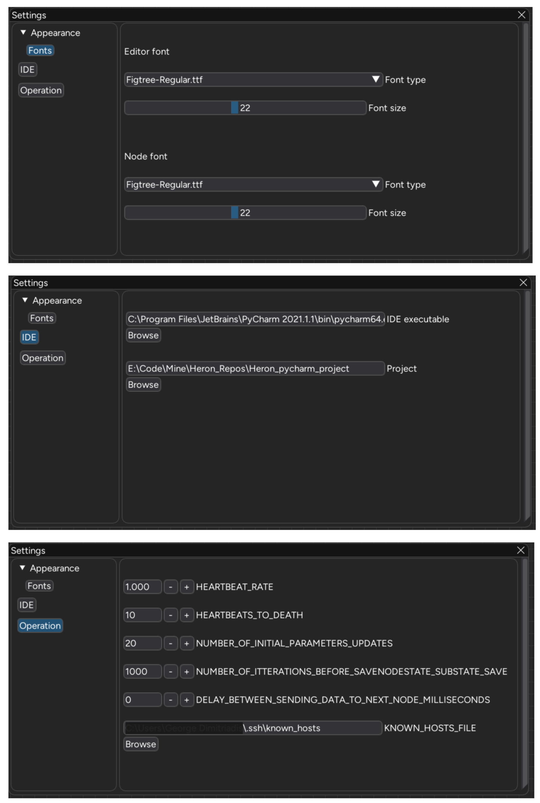

The Editor
===========

Node Tree and the Editor
------------------------
Heron's GUI is one of the two hearts of the framework (yes, Heron is a beast with two hearts, the other being
whatever tool one uses to write the code for the different Nodes).

The Heron GUI (see Figure 1) has three main regions, the Menu Bar, the Node Tree and the Editor.
The Node Tree is where all the Nodes available to Heron are represented as buttons. Pressing one of these will add
the corresponding Node to the Editor  The Node Tree is populated automatically by reading the Operations
folder of the Heron code base.

The Editor is where a user, having loaded all required Nodes connects them with Links and sets the parameters in them.

    Figure 1.

Node Window
-----------
Each Node is represented in the Editor as a Node GUI (see Figure 2). The Node GUI is separated in four regions from
top to bottom. The top is the Name of the Node. This is colour coded to denote the type of Node. Double clicking on
the Node name will open the Node's code (com and worker scripts) in the IDE of choice.

The second down is the Node's Controls region. This is populated by four buttons: The Network, the Save, the Info and
the Delete. The Network button will open the Network Menu where one can fill in the local and remote servers and the
paths to the used python and worker script executable (see :doc:`lan_use`). The Save button will open the Save Menu
where one can fill in the paths to the com log and worker save substate folder (see :doc:`node_types`, :doc:`debugging`
and :doc:`saving_state`). The Info is a toggle button that when on allows viewing of the Node's tooltips when the mouse
is hovered over the corresponding region. Finally the Delete button will delete the Node from the Editor and the Graph
(like the Del keyboard button).

The third region down is the Parameters region. This is where the user will fill in the parameter values for the Node.
The parameters are live, that means that when the Graph is running (that is, all the Nodes are running their com
and worker scripts and the GUI cannot be used as an Editor), a change in the parameters in the GUI will propagate all
the way to the worker script (even on another machine). It is up to the worker script of each Node to decide if it
wants to do something with that (see :doc:`writing_new_nodes`)

The fourth region is the Inputs/Outputs regions where the Node offers connection points to link to other Nodes.

    Figure 2.

Menu Bar
--------

The Menu Bar has three drop down menus (see Figure 3). The *File* menu offers the *New*, *Load* and *Save*
buttons that do exactly what you'd expect them to do. The *Edit* menu offers two items, the *Edit IPs/ports* and the
*Settings*.

The *Edit IPs/ports*  opens Heron's SSH Info Editor (SIE) where one can specify the different machines on the
network accessible to Heron (see :doc:`lan_use`). The *Settings* entry will open the Settings window where the user
can edit the different Settings of Heron.

Finally the *Nodes* button offers the options
*Add new Operations Folder (as Symbolic Link from Existing Repo)*, *Download Operations from the Heron-Repositories page*
and *Create New Node*.
The first option allows one to point to a repository on their hard disk that is structured to hold code for one or more
Heron Nodes and add a symbolic link of this code to the appropriate place in the Heron/Heron/Operations folder
so that Heron's Node Menu will see them as valid Nodes (see :doc:`adding_repos`). The second entry does the same thing
but now asks the user for the URL of an online repo and uses git to clone this locally (where the user points to) and
then adds that repo to the Operations folder just as the first option above. Finally the third option start the process
of creating a new Node using Heron's GUIs.

    Figure 3.

The Graph Control Buttons and the Nodes' life cycle
--------------------------------------------------

Under the Menu Bar and over the Node Menu are two buttons called *Start Graph* and *End Graph*. When the Editor is in
Edit mode the *Start Graph* is blue (can be pressed) while the *Stop Graph* is grey (cannot be pressed).
When the *Start Graph* is pressed the Editor leaves Edit mode and enters Run mode. That means the following:

#. The Node Menu becomes inactive and no new Nodes can be added to the NEW.
#. Heron starts one by one the Nodes in the NEW (in the order they were added to the NEW). As each Node has both its com and worker scripts executed it will show on the NEW a white surround box (indicating both scripts are executing correctly).
#. When all Nodes are running, then the *Start Graph* button will grey out (become inactive) and the *End Graph* one will become blue (able to be pressed).

When the *End Graph* is pressed Heron will close down all com scripts. This shutting down will trigger the end of life
system of Heron which a few seconds later will cause all of the worker scripts to self destruct. During that time Heron
will inform the user by showing a graphical timer (a download bar).

The closing down period
^^^^^^^^^^^^^^^^^^^^^^^

The number of seconds it takes for the worker scripts to close themselves down after Heron has terminated all of the com
scripts (either when the Graph exits or when Heron closes) is defined by the HEARTBEAT_RATE and HEARTBEATS_TO_DEATH
parameters found in the constants.py script. By default the HEARTBEAT_RATE is set to one (second) and the
HEARTBEATS_TO_DEATH to 5. That means it takes the worker scripts 5 seconds of Heron inactivity to close down.

There is a balance to be had here. If there are worker scripts that need more time to execute a single loop (data
entering, data manipulated, data leaving) than the number of seconds it takes for a worker script to close itself down
then the script will terminate while it is still doing work. So if you have Nodes killing themselves off without having
the chance to do anything check out the time it takes for them to go through one iteration and if it is bigger than
HEARTBEAT_RATE * HEARTBEATS_TO_DEATH (in seconds) then increase these constants to give your Nodes time to finish.

On the other hand if all your Nodes do their work much faster than this waiting time then decreasing it will make Heron
get out of Run mode and back into Edit mode faster.

The HEARTBEAT_RATE and HEARTBEATS_TO_DEATH constants are local to each machine. So it is feasible that your GUI running
machine has a number (say the default 5s) but on another machine you have set this number to another number (say 10s)
because the Node on this machine takes its time to complete an iteration. That means though that Heron's GUI will
come out of Run mode in 5s but there will still be another 5s that the 2nd machine will need to kill its worker script.
If you start the Graph again within those 5s then guess what will happen.

Settings
--------

The Settings window allows the user to control certain aspects of Heron. It currently offers three Options, the Appearance,
where the font types and sizes for the Editor and the Nodes can be set, the IDE where a user can set the path to the IDE
they use to develop code (and the path to a project that code is connected to if there is one) and the Operation where
the user can set a series of Heron variables that control the way Heron connects its Nodes and passes messages around.

    Figure 4.

Having set the IDE (and potential project) path will allow Heron to open up the code of a Node in that IDE when the user
double clicks on the title bar of a Node. It will also allow Heron to open the auto-generated scripts in that IDE when
the user uses Heron's GUI to create a new Node.

The variables in the Operation option have been described in different parts of the documentation:
HEARTRATE and HEARTBEATS_TO_DEATH in the paragraph above, the NUMBER_OF_INITIAL_PARAMETER_UPDATES in :doc:`node_types`,
the NUMBER_OF_ITTERATIONS_BEFORE_SAVENODESTATE_SUBSTATE_SAVE in :doc:`saving_state`, the
DELAY_BETWEEN_SENDING_DATA_TO_NEXT_NODE_MILLISECONDS in :doc:`node_types` and the KNOWN_HOSTS_FILE in :doc:`installation`.
