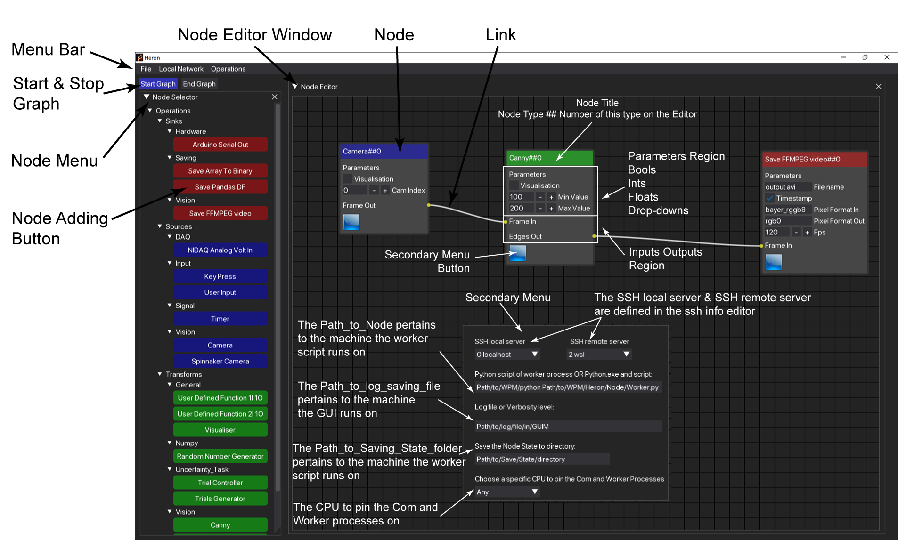
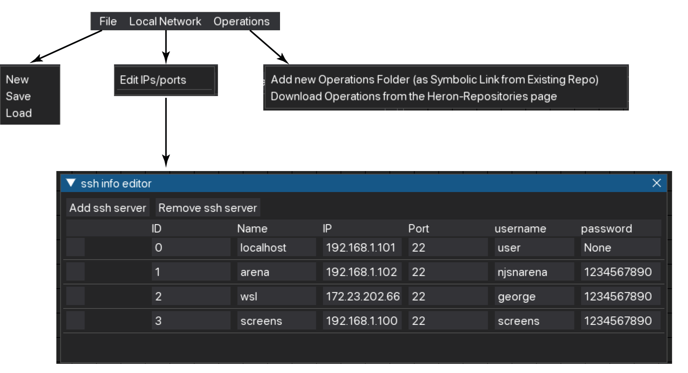

The Editor
===========

Node Menu and Node Editor Window
-------------------------------
Heron's editor is one of the two hearts of the framework (yes, Heron is a beast with two hearts, the other being
whatever tool one uses to write the code for the different Nodes).

The editor (see Figure 1) has three main regions, the Menu Bar, the Node Menu and the Node Editor Window (NEW).
The Node Menu is where all the Nodes available to Heron are represented as buttons. Pressing one of these will add
the corresponding Node to the NEW. The Node Menu is populated automatically by reading the Operations
folder of the Heron code base.

The NEW is where a user, having loaded all required Nodes connects them with Links and sets the parameters in them.
The parameters are live, that means that when the Graph is running (that is, all the Nodes are running their com
and worker scripts and the GUI cannot be used as an Editor), a change in the parameters in the GUI will propagate all
the way to the worker script (even on another machine). It is up to the worker script of each Node to decide if it
wants to do something with that (see :doc:`writing_new_nodes`)

Menu Bar
--------

Finally there is the Menu Bar with three drop down menus (see Figure 2). The *File* menu offers the *New*, *Load* and *Save*
buttons that do exactly what you'd expect them to do. The *Local Network* menu offers a single item, *Edit IPs/ports*.
When this is pressed Heron's SSH Info Editor (SIE) window appears where one can specify the different machines on the
network accessible to Heron (see :doc:`lan_use`). Finally the *Operations* button offers the options
*Add new Operations Folder (as Symbolic Link from Existing Repo)* and *Download Operations from the Heron-Repositories page*.
The second option does not have any functionality implemented yet (i.e. it does nothing at the moment). The first
option allows one to point to a repository on their hard disk that is structured to hold code for one or more Heron Nodes
and add a symbolic link of this code to the appropriate place in the Heron/Heron/Operations folder so that Heron's
Node Menu will see them as valid Nodes (see :doc:`adding_repos`).

Secondary Node Window
---------------------

As can be seen in Figure 1 each Node has a blue button at the bottom left that when pressed calls a secondary window
allowing the input of extra information regarding the Node. Here is where the user tells the Node:

#. On which machine to run
#. Which worker script to call
#. Where to save log info that comes from the com script of the Node
#. Where to save the Relic if the worker script is implementing one

For points 1 and 2 see :doc:`lan_use`, for point 3 see :doc:`node_types` and :doc:`debugging` and for point 4
see :doc:`the_relic_system`.

The Graph Control Buttons and the Nodes' life cycle
--------------------------------------------------

Under the Menu Bar and over the Node Menu are two buttons called *Start Graph* and *End Graph*. When the Editor is in
Edit mode the *Start Graph* is blue (can be pressed) while the *Stop Graph* is grey (cannot be pressed).
When the *Start Graph* is pressed the Editor leaves Edit mode and enters Run mode. That means the following:

#. The Node Menu becomes inactive and no new Nodes can be added to the NEW.
#. Heron starts one by one the Nodes in the NEW (in the order they were added to the NEW). As each Node has both its com and worker scripts executed it will show on the NEW a white surround box (indicating both scripts are executing correctly).
#. When all Nodes are running, then the *Start Graph* button will grey out (become inactive) and the *End Graph* one will become blue (able to be pressed).

When the *End Graph* is pressed Heron will close down all com scripts. This shutting down will trigger the end of life
system of Heron which a few seconds later will cause all of the worker scripts to self destruct. During that time Heron
will inform the user by showing a graphical timer (a download bar).

The closing down period
^^^^^^^^^^^^^^^^^^^^^^^

The number of seconds it takes for the worker scripts to close themselves down after Heron has terminated all of the com
scripts (either when the Graph exits or when Heron closes) is defined by the HEARTBEAT_RATE and HEARTBEATS_TO_DEATH
parameters found in the constants.py script. By default the HEARTBEAT_RATE is set to one (second) and the
HEARTBEATS_TO_DEATH to 5. That means it takes the worker scripts 5 seconds of Heron inactivity to close down.

There is a balance to be had here. If there are worker scripts that need more time to execute a single loop (data
entering, data manipulated, data leaving) than the number of seconds it takes for a worker script to close itself down
then the script will terminate while it is still doing work. So if you have Nodes killing themselves off without having
the chance to do anything check out the time it takes for them to go through one iteration and if it is bigger than
HEARTBEAT_RATE * HEARTBEATS_TO_DEATH (in seconds) then increase these constants to give your Nodes time to finish.

On the other hand if all your Nodes do their work much faster than this waiting time then decreasing it will make Heron
get out of Run mode and back into Edit mode faster.

The HEARTBEAT_RATE and HEARTBEATS_TO_DEATH constants are local to each machine. So it is feasible that your GUI running
machine has a number (say the default 5s) but on another machine you have set this number to another number (say 10s)
because the Node on this machine takes its time to complete an iteration. That means though that Heron's GUI will
come out of Run mode in 5s but there will still be another 5s that the 2nd machine will need to kill its worker script.
If you start the Graph again within those 5s then guess what will happen.

