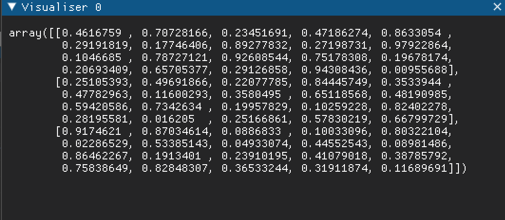
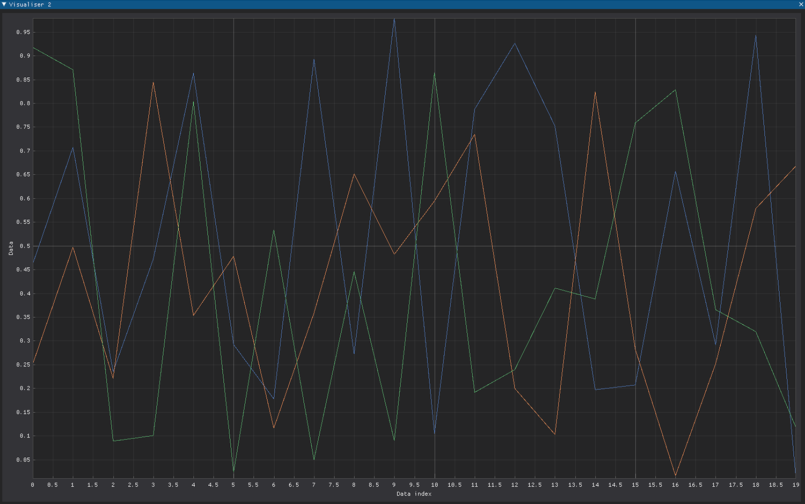
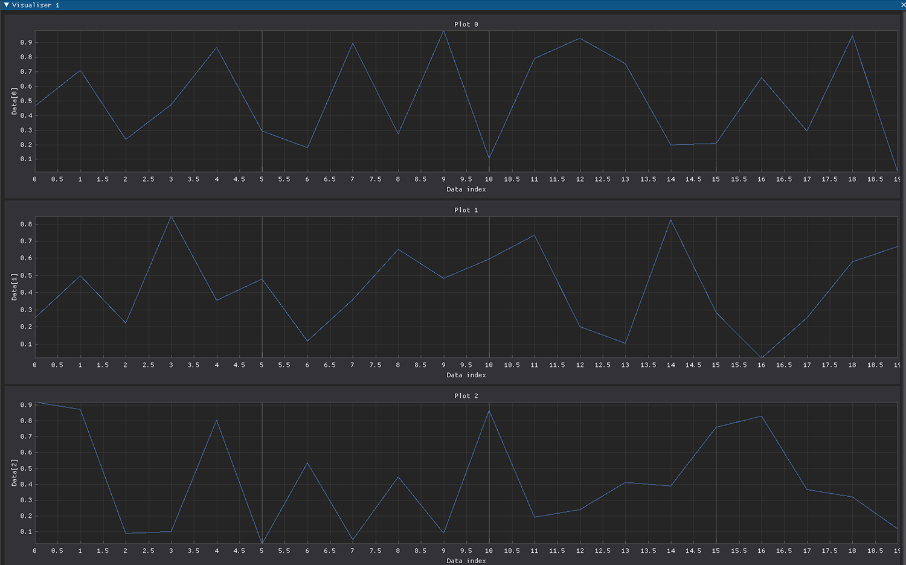

In Node Visualisation
=====================

The API
________

Heron defines an API for simple visualisation that the Node developer can use to add data visualisation elements to a
Node without developing them from scratch.

This is the API that is also used by the Visualisation Node.

The in Node visualisation is based on the class VisualisationDPG in the gui/visualisation_dpg.py script.

To use the API one first needs to import the class and define a global variable with VisualisationDPG type:

.. code-block:: python

    from Heron.gui.visualisation_dpg import VisualisationDPG

    vis: VisualisationDPG

then, in the initialisation function the vis object needs to be instantiated. The VisualisationDPG class takes 8 arguments:

* _node_name: The node's name (found in worker_object.node_name)
* _node_index: The node's index (found in worker_object.node_index)
* _visualisation_type: This defines the type of visualisation. Currently the VisualisationDPG class supports images, text boxes, plots with a single pane which can show 1D and 2D arrays and plots with multiple panes which can show only 2D arrays. In both the single pane and multi pane plots the x axis of the panes is given by the left (fastest changing) axis of a 2D array. The possible values of the argument can be 'Image', 'Value', 'Single Pane Plot', 'Multi Pane Plot'
* _buffer: The number of data points shown on a single visualisation window if the visualisation_type is a Plot or the number of the latest data messages that have been received or generated by the Node if the visualisation_type is Value. This does nothing if the visualisation_type is an Image.
* _image_size: The size of an image if the _visualisation_type is 'Image'
* _x_axis_label: A string with the name of the x axis of the plot(s)
* _y_axis_base_label: A string with the base name of the y axes for the Multi Pane or the name of the y axis for the Single Pane. In the Multi Pane the actual names will be numbered ('_y_axis_base_label 0', '_y_axis_base_label 1', etc.)
* _base_plot_title: A string giving the base label name for each plot for Multi Pane, or the name of the plot for Single Pane. In the Multi Pane the actual plots will be numbered starting from 0 as in the case of the _y_axis_base_label

An example of making a VisualisationDPG object for a text box type of visualisation is the following:

.. code-block:: python

    visualisation_type = 'Value'
    buffer = 20
    vis = VisualisationDPG(_node_name=_worker_object.node_name, _node_index=_worker_object.node_index,
                           _visualisation_type=visualisation_type, _buffer=buffer)

In the worker function one needs to first check if the visualisation is visible or not (assuming a
Visualisation parameter has been defined in the com script) and then pass the data to be visualised to the vis object:

.. code-block:: python

    global vis

    vis.visualisation_on = parameters[0]

    vis.visualise(some_data_to_visualise)

The VisualisationDPG object will take care of creating and killing the required separate threads so that the visualising
element requested through the visualisation_type argument will show only when the vis.visualisation_on is true.

Finally, the VisualisationDPG object needs to properly close down some graphical elements before the process terminates
so in the end of life function one needs to add:

.. code-block:: python

    global vis
    vis.end_of_life()

Nothing is stopping a Node to have multiple visualisations. Just create multiple VisualisationDPG objects following the
above ideas.

The visualisation elements
___________________________

1. The Image

The VisualisationDPG class uses OpenCV's imshow to display images.

2. The Value

The VisualisationDPG object will open a text box where the values of the variables passed to the object for
visualisation will be displayed. As mentioned above the buffer here means how many values from past iterations
are kept visible in the text box.

3. The Single Pane Plot

The Single Pane Plot will display 1D or 2D numpy arrays in a single window. In the case of 2D arrays with shape (x, y),
there will be x number of lines, each of y number of points.

4. The Multi Pane Plot

The Multi Pane Plot will display 2D numpy arrays with shape (x, y) over x plots each with y number of points.

