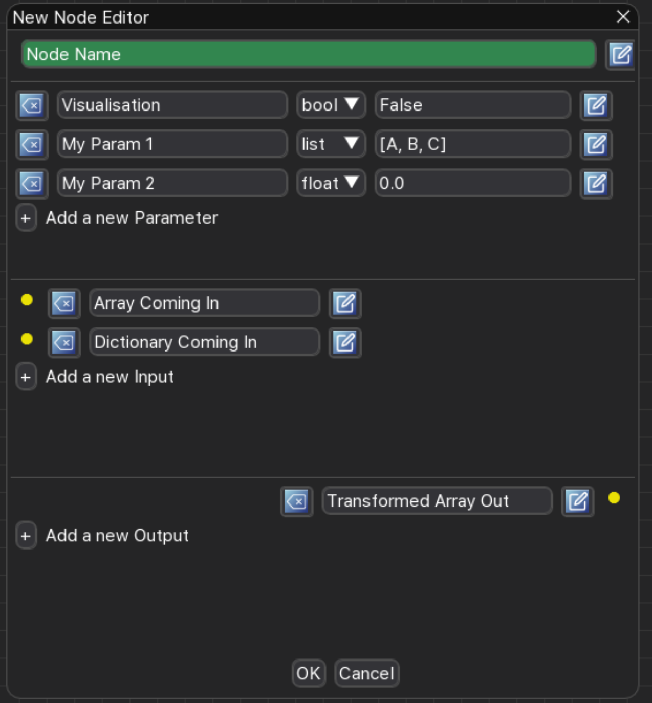

Writing new Nodes
==================

In order to write a new Heron Node one needs to do two things. First create a correct Node folder/file structure and
then populate the xxx_com.py and xxx_worker.py scripts with the appropriate code. Heron offers both a GUI based and
a manual way to generate a Node's file/folder structure, create and fully populate the xxx_com.py script and write the
boilerplate code of the xxx_worker.py script. The filling in of the worker script with the actual functionality of the
code is something that has to happen by the user (obviously).

In the following we first describe the fully manual way of creating Nodes. Having a grasp of this will make it much
easier to understand exactly what Heron does to create a Node through its GUI and how to go on about creating the
functional code of the worker script.

The Manual Way
----------------
The file/folder structure of a Node is fully described in the 'Creating a valid Heron Nodes repository from scratch'
paragraph of the :doc:`adding_repos` section. The one thing that is beyond the scope of this manual, which is not necessary,
but is most definitely good practice, is to create a repository for the new Node(s), (ideally in the
`Heron-Repositories <https://github.com/Heron-Repositories>`_ GitHub organisation, but anywhere is better than nowhere).

This part of the manual will deal with the second step, that of writing the code in the two Python scripts to create a
functional Node.

The Node templates
------------------
In order to get started with Node writing, the fastest way is to copy into the new Node folder the xxx_com.py and
xxx_worker.py template scripts from Heron's templates directory according to what type of Node you are trying to
construct (Source, Transform or Sink). The xxx_com.py scripts for all three types are identical but the xxx_worker.py
ones are different.
Of course using as a template another Node that is similar in functionality to what you want to achieve is often better
than a generic template so also have a look through the code of the existing Heron Nodes in the Heron-Repositories
organisation.

In the templates there is code that must not be altered, code that is placeholder for your code and comments clearly
marking what is what and giving advice on how to write your own code. If you are new to writing Nodes in Heron read
carefully through all the commends of the scripts to familiarise yourself with what you need to do to create a
functional Node code base.

Because the template scripts were authored in PyCharm some comments are actually PyCharm editor-fold structures
that allow you to minimise and maximize different parts of the scripts. Ignore them if you are not using a JetBrains
editor.

______________________________________________________________________________________________________________________________

The com script
---------------
The xxx_com.py script (from now on referred to as simply the com script) deals with the basic definition of the Node.

This definition comprises of the following variables:

* BaseName
* NodeTooltip
* NodeAttributeNames
* NodeAttributeType
* ParameterNames
* ParameterTypes
* ParametersDefaultValues
* ParameterTooltips
* InOutTooltips
* WorkerDefaultExecutable

The Node's Name
^^^^^^^^^^^^^^^
The BaseName is a string that provides the name of the Node (e.g. 'Camera' or 'My Super Duper Node'):

.. code-block:: python

    BaseName = 'My Super Duper Node'

The Node's Tooltip
^^^^^^^^^^^^^^^^^^
This is a string that should describe the Node's functionality. It will be visible in Heron's main GUI by hovering over
the Node's title if the info toggle button of the Node is on.

The Node's Attributes
^^^^^^^^^^^^^^^^^^^^^
Each Node can have three types of Attributes. Its inputs (with Type 'Input'), its outputs (with Type 'Output') and its
parameters (with Type 'Static'). The NodeAttributeNames is a list of strings that define the names of the Node's
attributes. If the Node has parameters then by convention the first item in the NodeAttributeNames is 'Parameters'. So
for example a Transform Node with parameters, two inputs and one output would have its Attributes names defined as follows:

.. code-block:: python

     NodeAttributeNames = ['Parameters', 'Data A In', 'Data B In', 'Transformed Data Out']

If a string of a NodeAttributeName also has the word 'Dict' in it (e.g. 'Transformed Data Out Dict') then the Node's GUI
will change the colour of that Input or Output to show to users that this Input is expecting a dictionary or this Output
is sending out a dictionary (instead of a numpy array).
As mentioned above the type of each Attribute can be 'Static', 'Input' or 'Output'. These are defined in the
NodeAttributeType entry again as a list of strings (following the same order as in the NodeAttributeNames list).
So for the above example the types would be defined as

.. code-block:: python

      NodeAttributeType = ['Static', 'Input', 'Input', 'Output']

The Node's Parameters
^^^^^^^^^^^^^^^^^^^^^^
The next three entries (ParameterNames, ParameterTypes and ParametersDefaultValues) are there to fully define the
parameters of the Node, if it has some. In case the Node doesn't have any parameters then assign an empty list to all the
entries (e.g. ParameterNames = []).

The ParameterNames is a list of strings with the names of the parameters. The ParameterTypes is a list of strings with
the type of each parameters (again same order as in the ParameterNames list). The possible types are:

* 'str'
* 'bool'
* 'int',
* 'float'
* 'list'

Each parameter according to its type will generate an appropriate element on the Node's GUI.

The first four types and their GUI elements are self-explanatory. The 'list' type is a parameter with a drop-down element.

The ParametersDefaultValues is a list that defines the default values of each of the parameters (what value each parameter
gets when a Node is added to the Node Editor). These values must be of the correct type (so a str for a 'str' type
parameter, int for an 'int', etc.) The 'list' parameters use their default values, which is a list of strings, to also
define the elements of the drop-down GUI element. The default value of these parameters is the first item in this list.

For example if a Node has two parameters, one 'int' called My Integer and one list called My Dropdown the above variables
would look like this

.. code-block:: python

    ParameterNames = ['My Integer', 'My Dropdown']
    ParameterTypes = ['int', 'list']
    ParametersDefaultValues = [5, ['1st item', '2nd item']]

Parameters' and Input, Output Tooltips
^^^^^^^^^^^^^^^^^^^^^^^^^^^^^^^^^^^^^^^
Just like the Node's tooltip, all parameters and inputs and outputs have their own description. This again
will be visible in Heron's main GUI by hovering over the Node's title if the info toggle button of the Node is on.

The Node's worker script
^^^^^^^^^^^^^^^^^^^^^^^^
Finally the Node needs to easily find its worker script for the (most) cases where the worker script runs on the same
machine as the Heron GUI and under the same Python environment. In this case the user shouldn't need to specify where the
script is. This is achieved by the WorkerDefaultExecutable variable. Since the worker script is always in the same
directory as the com script the WorkerDefaultExecutable variable should always be defined as follows

.. code-block:: python

    WorkerDefaultExecutable = os.path.join(os.path.dirname(Exec), 'xxx_worker.py')

where 'xxx_worker.py' is the string of the name of the worker script provided by the Node's developer.

______________________________________________________________________________________________________________________________

The worker script
-----------------

The worker script is the script that defines the worker process. It is where the main code of the Node's functionality
is written. That doesn't mean that the Node cannot have code defined in more scripts, but the worker script (xxx_wroker.py)
is the script that the rest of Heron's communication protocol interacts with.

The worker script like the com script has some code that needs to always exist and is common to all worker scripts.
This can be found in the Node templates and is annotated appropriately. The user added code needs to define two
functions and can define an optional third one. The optional (but highly recommended)
function is the initialisation function. The two required ones are the worker function and the end of life function.

The three functions are defined in the first call in the main if loop of the script. E.g. for Transform Nodes
this line would look like:

.. code-block:: python

    if __name__ == "__main__":
    worker_object = gu.start_the_transform_worker_process(work_function=some_work_function,
                                                          end_of_life_function=on_end_of_life,
                                                          initialisation_function=initialise)

where the some_work_function becomes the worker function, the on_end_of_life function becomes the end of life function
and the initialise becomes the initialisation function.

The worker object
^^^^^^^^^^^^^^^^^
Before continuing with the description of the worker script we need to explain what the worker object (named as
worker_object in code) is. Each Node type has two classes that define Heron's basic Node functionality (irrespective of
what the Node actually does) and ensure Heron's communication protocol runs properly. One class is called XXXCom and
the other XXXWorker where XXX can be Source, Transform or Sink. When the worker process spins up the first thing that
happens is the creation of a worker_object of type XXXWorker (e.g. worker_object = SourceWorker(lots of arguments)).

This worker object is the main way the rest of Heron communicates with the worker process. The Node developer can use
the worker_object because it gets passed in some of the worker script functions when they are called (by the worker_object
itself). Where this is useful will be discussed further down.

The differences between Source Nodes and Transform and Sink Nodes
^^^^^^^^^^^^^^^^^^^^^^^^^^^^^^^^^^^^^^^^^^^^^^^^^^^^^^^^^^^^^^^^^

Because Transform and Sink Nodes operate on incoming data, their worker function is a callback that Heron's communication
protocol will automatically call every time a new message arrives into the worker process of the Node. On the other
hand, in the case of the Source Nodes, the worker function generates its own data so it needs to be developed as a
loop that runs for as long as the Node is running. How to do this is clearly shown in the Source template. So in the
case of Transforms and Sinks, Heron will call the worker function every time new data come in, while in the case of
Sources, Heron will call the worker function only once at the start of the worker process.

The above difference also generates a second difference that has to do with the communication of the worker processes
with the Heron GUI process. This communication allows the parameters set in Heron's GUI to pass to the corresponding
worker processes. For more details see the following paragraph on the initialisation function.

Finally this difference means also that the worker functions of the Transforms and Sinks are passed different arguments
than the worker functions of the Sources when they are called by the Heron framework. Again for more details keep reading.

The initialisation function
^^^^^^^^^^^^^^^^^^^^^^^^^^

The initialisation function is used in order for the Node to run any initialisation code before it starts calling the
worker function. Apart from initialisation code pertaining to the specific Node, all worker processes need to check that
they can read the parameters sent from the Heron GUI process. This communication takes some time to initiate during which the
worker function must not be called. When a worker process starts, Heron will send the Node's parameters to the worker process.
It will try to do so NUMBER_OF_INITIAL_PARAMETERS_UPDATES times (this variable is set in the constants.py script) with
500ms gap in between. If it fails then the worker process will not function and it will terminate after
HEARTBEAT_RATE * HEARTBEATS_TO_DEATH seconds. Every time Heron's GUI sends parameters to the worker process, the process
checks if it has an initialisation function and if it is marked as initialised. If it has an initialisation function and
isn't initialised it will call its initialisation function (which should always try to read the parameters). If it
returns True then the parameters have been read (and all other initialisation has been completed) and then the worker
process is marked as initialised.

In order for the above mechanism to work the initialisation function must always check if it can read parameters from
the worker_object. This is done with code that looks like this

.. code-block:: python

    try:
        parameters = worker_object.parameters
        global_var_1 = parameters[1]
        global_var_2 = parameters[2]
        global_var_3 = parameters[3]
        global_var_1 = parameters[4]
    except:
        return False

The worker_object is passed as an argument to the initialisation function.

In the case of Transform and Sinks, every time new data come and before the worker function is called,
Heron checks if the worker process has been marked as initialised. If this is not the case the worker function
is not called and the incoming message is dropped. Once the process is marked as initialised the
worker function gets called normally for every new incoming message.

In the case of Sources the worker function gets called only once so the above mechanism is not applicable. The
communication between the Heron GUI and the worker process though still might require a little bit of time to be
established and before that happens (and thus the parameter values can be known) the infinite loop of the worker
function cannot start. Ensuring that the loop starts after the parameters are properly updated is, in the case of
Sources up to the Node's developer. See the worker function paragraph on how this is done.

The worker function
^^^^^^^^^^^^^^^^^^^
The worker function is where the main code of the Node needs to be constructed. As mentioned above in the case of the
Transforms and Sinks this function needs to be a callback while in the case of the Sources the main functionality is
an infinite loop.

Sources
""""""""
The Source Node worker function is passed a single arguments, namely the worker_object we described above.
As mentioned above the Source worker function needs to give Heron some time to communicate with the worker process
before it starts generating data. This is usually done with a small loop before the infinite loop, which ensures the
initialisation function has run properly and the parameters can now be read from Heron's GUI:

.. code-block:: python

        need_parameters = True

        while need_parameters:
        if worker_object.initialised:
            need_parameters = False
            running = True
            gu.accurate_delay(10)

The worker_object.initialised is how a worker process is marked as initialised or not and it will be true only after the
initialisation function returns true.

The worker function of a Source Node does not return anything. In order to push the data generated in every iteration
of its infinite loop to the com process of the Node it needs to call the following function:

.. code-block:: python

    worker_object.send_data_to_com(result)

where result is what the Node needs to send on and can be either a numpy array of arbitrary dimensions and type or a
json compliant dictionary (i.e. a dictionary that can be saved into a json file without errors).

A current limitation of Heron is that Source Nodes cannot have more that one output (the way Transforms and Sinks do).

Transform and Sinks
""""""""""""""""""

The worker function fo the Transform and Sink Nodes get passed two or three arguments (i.e. the developer can implement
it with either two or three arguments). The two arguments that get always passed are the parameters (as they are
currently displayed on the Node's GUI) and that new data that are responsible for calling the worker function in the
first place. The third (optional to implement) argument is a function that allows saving in the Save State System anything
the developer wants (see :doc:`saving_state` for a description of the use of this argument).

The parameters is a list of the current parameter values.

The data is a list of two items. The first is a string that fully describes the Node and output of the Node that sent
the data and the Node and input of the Node that is receiving the data (i.e. that is, the current Node and the name of
the input from which the data came through).
The format of the topic is

previous_node_output_name##previous_node_name##previous_node_index -> this_node_input_name##this_none_name##this_node_index

An example (of a topic that would connect the Frame Out output of a Camera Node to the Frame In input of a Canny Node)
would be:

Frame Out##Camera##0 -> Frame In##Canny##0

The topic is useful for the worker function to distinguish between data coming in from different inputs of the Node
or from different output Nodes if multiple Nodes are connected to this Node's inputs.

The second part of the data list is the actual payload which consists always of a message that needs a little bit of
reconstruction. That is achieved with either the

.. code-block:: python

    message = Socket.reconstruct_data_from_bytes_message(message)

or

.. code-block:: python

    message = Socket.reconstruct_array_from_bytes_message_cv2correction(message)

functions of the Socket class (from Heron.communication.socket_for_serialization import Socket)

The reconstruct_array_from_bytes_message_cv2correction function is used to correct an OpenCV bug that breaks the library
if the incoming numpy array has signed data. So use it when dealing with images, or when you want to make sure for
some other reason that the numpy array you operate on has unsigned data. The reconstruct_data_from_bytes_message will
work with both numpy arrays of arbitrary type and with json compliant dictionaries.

Once the worker function has the topic and the numpy array or dictionary coming into the Node then it can do the work
required.

The Transform Nodes also have output. In contrast to the Source Nodes, the worker function of a Transform creates the
Node's output simpy by returning a list of numpy arrays and or dictionaries. The list must be as long as the number of
outputs defined for the Node (this is done in the com script as shown above). The order of the numpy arrays / dictionaries
is the same as the order of the outputs defined in the com script. If a worker function needs to output nothing to one
or more of its outputs then it needs to pass the ct.IGNORE string (as defined in the constants script of Heron) but
needs to wrap it in a numpy array: np.array([ct.IGNORE]). So for example a Transform Node with two outputs that should
return the array my_array on the first and nothing on the second would have a return statement that looks like this:

.. code-block:: python

    return [my_array, np.array([ct.IGNORE])]

If the Node has a single output then the numpy array or dictionary returned still needs to be put in a list:

.. code-block:: python

    return [my_array]

There are two more elements of Node scripting, the :doc:`in Node Visualisation API <visualisation>` and the
:doc:`Save State System for saving state <saving_state>` which are described in their own documentation.

The end of life function
^^^^^^^^^^^^^^^^^^^^^^^^
The final function that must be defined in a worker script is the end of life function. Heron will call this function
when the process terminates itself (see the Running a Graph (a Node's life) paragraph in :doc:`node_types`). This is
where code that deals with gracefully closing down the process should be written (e.g. closing graphical elements,
releasing memory, etc.). Since this function has to be defined, if there is nothing to close down then a pass call
should be used.

Constructing a Node from a GUI
------------------------------
By clicking on Menu Bar -> Nodes -> Create New Node you can start a GUI that allows you to quickly construct a Node's
basic structures. The first thing that Heron will ask you is the base folder you want to create the Node in.
Heron expects the base folder of a folder structure that can potentially store many Nodes and can act as a repo's
base folder (see :doc:`adding_repos` for the folder structure of a Node). The folder does not have to be an empty one and
Heron will happily work with a folder that hosts other Nodes. Once you have selected this folder Heron
will show you the Node generation GUI.

The GUI's entries are self explanatory. You can add and delete entries but before you close the window (with the OK
button or the close window X) you have to have all widgets of all entries filled (that includes the types and default
values of the parameters). The edit button at the end of any row will open a separate text input window where you can
write the tooltips for the that row (highly recommended). Canceling will close the window and abort the process.

The first parameter of the GUI can be named 'Visualisation'. This doesn't have to exist but see further on what adding
such a parameter will do. If it does it has to have a type of bool (with a default value set to either True or False).

Once you press the OK (or the X) button Heron will automatically generate the correct folder structure in the base folder
you have indicated and in there will create the two xxx_com.py and xxx_worker.py scripts. The com script will be fully
generated and no extra editing will be required (unless of course you realise you have made a mistake in some of the
Node's attributes in which case just go ahead and change what is required straight in the com script).

The worker script will be generated automatically and filled with the appropriate boilerplate code as well as quite a
bit of code appropriate  to the type of the Node you are creating and whether a Visualisation parameter has been defined.
Of course the main code that does the actual work of the Node will have to be filled in manually but the predefined
part of the script will act as a solid segway in defining for you all the things Heron needs to see for a fully
functional Node.

The output of these worker scripts will always be

.. code-block:: python
    result =  [np.array([ct.IGNORE]), np.array([ct.IGNORE]), ...]
    ...
    return result

with as many np.array([ct.IGNORE]) as the Node has outputs. It is up to you to change these entries to the appropriate
numpy arrays or dictionaries the Node is supposed to output (see the :doc:`worker function` entry above)

